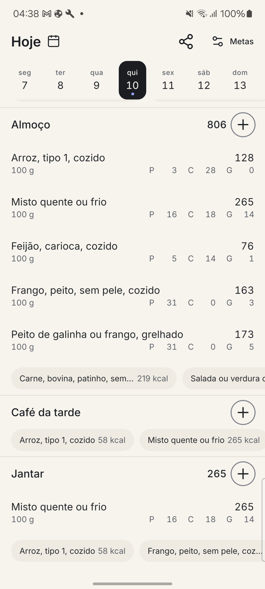
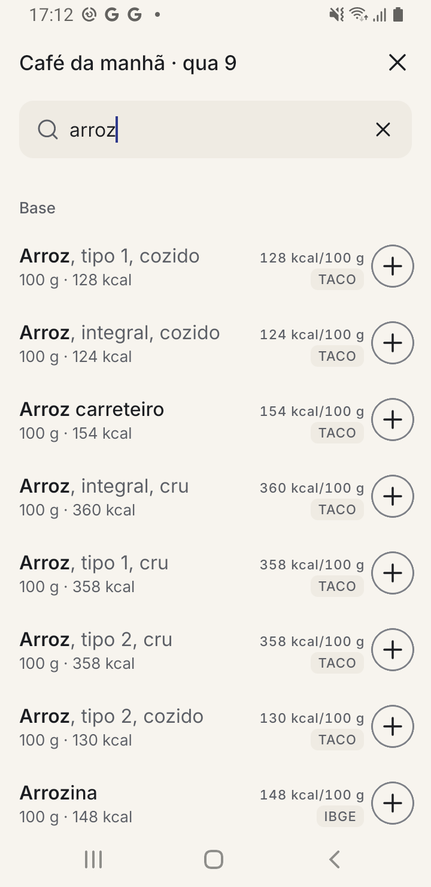
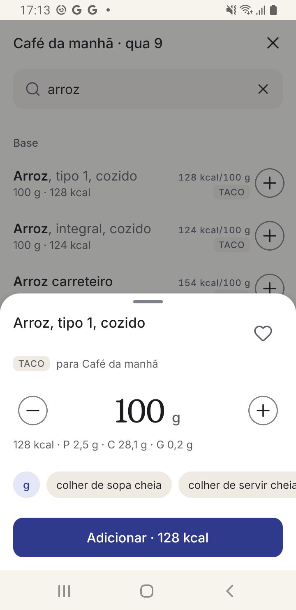
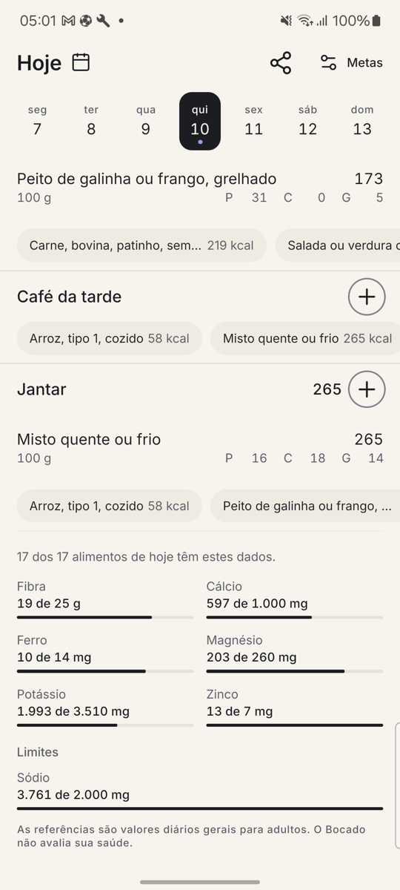
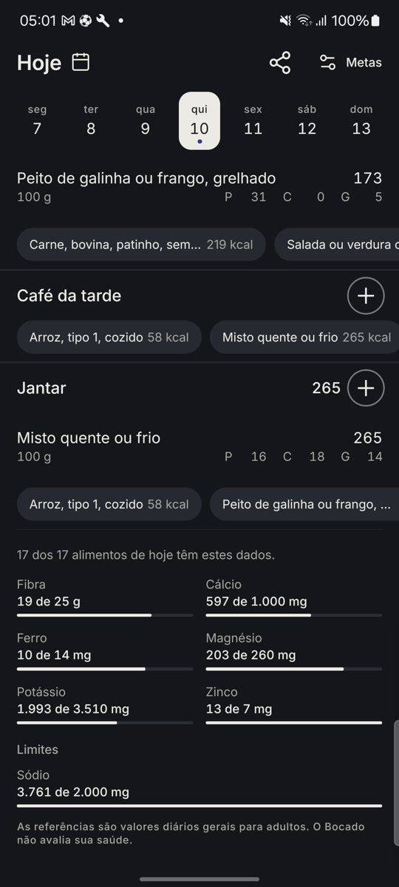
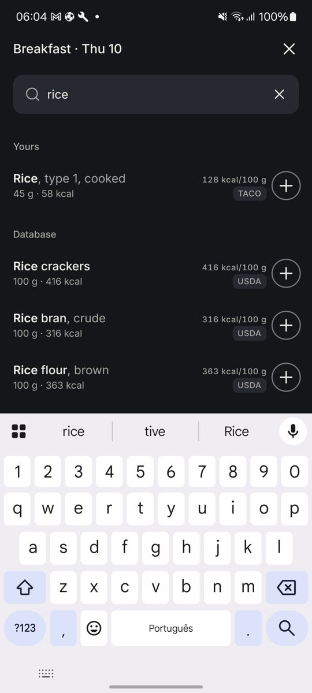

<div align="center">

# Bocado

**A calorie counter that logs Brazilian food in three taps, offline, without an account.**

Brazilian food tables · household measures · React Native · no ads, no paywall

</div>

---

Every calorie counter can tell you that 100 g of rice is 128 kcal. None of them
know that a _colher de servir_ of it weighs 45 g — which is the only unit anyone
actually uses at a Brazilian table. Bocado ships the official tables with the
household measures attached, so logging lunch is three taps and no arithmetic.

| Today                                      | Search                                      | Portion                                     |
| ------------------------------------------ | ------------------------------------------- | ------------------------------------------- |
|  |  |  |

| Micronutrients                                      | Dark theme                                       | English                                            |
| --------------------------------------------------- | ------------------------------------------------ | -------------------------------------------------- |
|  |  |  |

---

## Why it exists

Food logging fails on friction, not on motivation. The research behind this app
([`docs/research/`](docs/research)) mined what people actually say when they quit:
the barcode scanner disappearing behind a paywall, ads interrupting the log, a
database where half an avocado ranges from 165 to 560 kcal, and — in Brazil —
a food list that does not contain _pão de queijo_.

So the product is defined by four decisions, and each one is a thing the app
refuses to do:

- **Three taps to log.** The "+" ring on a meal, "+" on the row, "Concluir".
  The entry is written the moment you tap "+", with an undo. No mandatory
  portion screen.
- **Offline first.** 2,319 Brazilian foods are bundled and imported into SQLite
  on first launch. Airplane mode changes nothing about the core loop.
- **No account, no ads, no paywall.** First run is three skippable screens and
  never asks for an email.
- **Calm by construction.** Going over the goal is information, not an alarm:
  no red, no green, no guilt copy anywhere.

## What the day screen shows

The diary row is the screen's smallest decision and the one that took the most
measuring. Each entry is 64 dp tall and holds two lines: the food name with its
calories on the first, the portion and the macros on the second. The macros sit
in fixed-width cells anchored to the right margin, so the protein of one food
lands directly above the protein of the next and a column can be read down
without arithmetic. Numbers use tabular figures; a macro the source never
measured leaves its cell empty rather than shifting the column.

Meal headers carry the meal's subtotal in a fixed 46 dp column aligned with the
entry calories, and an ink "+" ring — not a filled accent button, because four
identical accents on one screen stop meaning anything. The ring is 48 dp and
announces itself as "Adicionar em {meal}".

At the end of the day sits an opt-in grid of what the tables actually measure:
fibre, calcium, iron, magnesium, potassium and zinc, with sodium kept apart
under "Limites" because it is a ceiling rather than a target. It shows absolute
amounts against general adult references, never a percentage, and it states how
many of the day's foods carry the data instead of implying all of them do.

## How it works

React Native 0.87 (bare), TypeScript, SQLite through `op-sqlite` with FTS5,
preferences in MMKV. No backend of any kind.

```
src/
  domain/     pure TypeScript — portion maths, ranking, day totals, the goal formula
  data/       SQLite, MMKV, food providers, the bundled seed
  features/   diary, add-food, portion, goals, share, sources
  components/ the design system's canonical parts
  theme/      colour, type, spacing, motion — the only source of any of them
  i18n/       pt-BR and en-US
```

`domain/` imports nothing from React or from `data/`; that is where the unit
tests live. Screens talk to repositories through hooks, never to SQLite.

**Search** answers from the local FTS5 index first, always, in under 50 ms. The
index is accent-insensitive by tokenizer, so `pao` finds _Pão, trigo, francês_.
Online providers are asked only after three characters and a 400 ms debounce,
under one 2.5 s deadline for the whole round, and everything they return is
cached locally and de-duplicated against what is already there.

**Every food takes one shape**, `NormalizedFood`, whatever its origin — the
contract is in [`docs/FOOD_DATA_CONTRACT.md`](docs/FOOD_DATA_CONTRACT.md), and
adding or dropping a source touches one file. A diary entry stores a snapshot
of the nutrients it was created with, so a later data update never rewrites
your history.

**In English**, the bundled foods carry English names too: 2,300 of the 2,319
(99.2%) resolve through a term-by-term glossary built at seed time, so
_Arroz, tipo 1, cozido_ reads _Rice, type 1, cooked_ rather than sitting
untranslated in an English interface. Household measures are translated in the
portion sheet, where 230 labels cover 99.9% of the measures in the tables.

## Data sources and licences

| Source                           | Role                                                    | Licence                    |
| -------------------------------- | ------------------------------------------------------- | -------------------------- |
| TACO 4ª ed. (NEPA/UNICAMP, 2011) | Brazilian foods analysed in a lab                       | citation required          |
| IBGE POF 2008-2009               | foods as eaten, plus 11,801 household measures in grams | open data, credit required |
| Open Food Facts                  | packaged products, fetched on demand                    | ODbL 1.0 + DbCL            |
| USDA FoodData Central            | generic foods in English                                | CC0 1.0                    |

Open Food Facts is never bundled, on purpose: shipping an extract would make
the bundled database a derivative under ODbL's share-alike. Fetching per
request and caching privately keeps it a Produced Work, which needs only
attribution. TBCA was rejected outright — its licence forbids commercial use.

The attributions are shown in the app under **Metas → Fontes de dados e
licenças**, and that screen is not optional.

## Run it

Node 22+, JDK 17, the Android SDK, and a device or emulator.

```bash
npm install
npm run android
```

Useful:

```bash
npm run validate            # prettier, eslint, tsc, jest
npm run seed:build          # rebuild assets/data/foods.seed.json from data/raw/
npm run android:test-build  # release-mode bundle, installed as a debug build
npm run android:release-build
```

The Android builds ship `armeabi-v7a` and `arm64-v8a`. Set `RN_ABIS` to narrow
that — `RN_ABIS=armeabi-v7a npm run android:test-build` builds for a 32-bit-only
phone and finishes in about half the time.

`.env` is optional — every value has a working default. Copy `.env.example` if
you want your own USDA key or a different contact address in the Open Food
Facts `User-Agent`.

## Testing

`npm run validate` runs 415 tests in 43 suites. The domain is covered where
being wrong would be silent: portion maths and unit conversion, day totals, the
Mifflin-St Jeor goal with its floors, the frecency ranking of suggestions, the
search ordering, month arithmetic for the calendar, the shared day and month
pieces, the macro-cell presentation rules, the micronutrient aggregation, the
English glossary, both online mappers against real captured payloads, and the
seed import.

Screens are verified on a real device, not in a simulator. Tasks 01 to 17 were
judged on a 2 GB Samsung Galaxy J6 — chosen because if the app is fluid there
it is fluid anywhere — and from 2026-09-10 the device is a Galaxy M53. The
constraints the J6 imposed are kept on purpose; see decision 8 in
[`docs/DECISIONS.md`](docs/DECISIONS.md).

## Known gaps

A household measure stored on an entry logged in Portuguese still reads in
Portuguese when the app is switched to English — the food name translates, the
measure does not, and they share a line. The portion sheet is unaffected.

## Roadmap

Barcode scanning with the camera, recipes, and a backup or export path.

Vitamins stay out on purpose. Coverage was measured against the bundled tables
in [`docs/research/05-descoberta-ajustes-ui.md`](docs/research/05-descoberta-ajustes-ui.md)
§6: vitamin A reaches only 28.4% of the foods the app actually pushes, and a
panel showing "no data" for four out of five items is a broken screen, not
partial data.

Already shipped past the first release: a month calendar for picking any day, a
dark theme with a Sistema/Claro/Escuro control, macros in aligned columns on
the diary row, meal subtotals and an ink "+" ring on every meal header, sharing
a day or a month as an image or as plain text, the day's fibre, sodium and five
minerals as an opt-in block, and English names for the bundled foods — see
[`docs/DECISIONS.md`](docs/DECISIONS.md).

## Licence

The code is the owner's. The bundled data belongs to its sources, under the
licences listed above.
